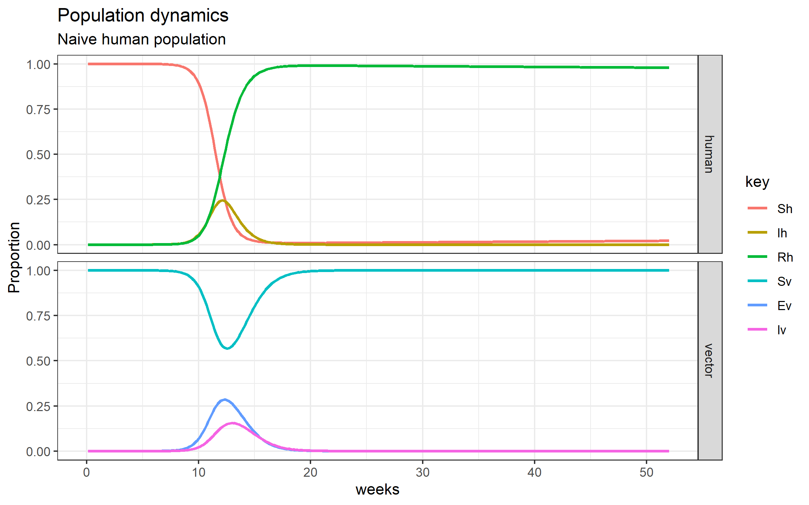

outbrake analysis and modelling for public health with RECON
============================================================

> “… dedicated to all human beings.”  
> *Reckoner by Radiohead*  
> Please, listen [here](https://www.youtube.com/watch?v=kPWvpDm076o)

references
----------

-   course link
    [here](https://www.ins.gov.co/modelamiento/modelamiento.html)
-   recon projects
    [here](https://www.repidemicsconsortium.org/projects/)
-   recon on github [here](https://github.com/reconhub)
-   recon learn [hear](https://www.reconlearn.org/)
-   official twitter \#hashtag?

products
--------

Here are some images of my learning process:

### host dynamics

$$ \\frac{dS\_h}{dt} = + \\mu\_h N\_h - \\frac{\\beta\_h S\_h}{N\_h} b I\_v - \\mu\_h S\_h $$

$$ \\frac{dI\_h}{dt} = \\frac{\\beta\_h S\_h}{N\_h} b I\_v - \\gamma\_h I\_h - \\mu\_h I\_h $$

$$ \\frac{dR\_h}{dt} = \\gamma\_h I\_h - \\mu\_h R\_h $$

### vector dynamics

$$ \\frac{dS\_v}{dt} = + \\mu\_v N\_v - \\frac{\\beta\_v S\_v}{N\_v} b I\_v - \\mu\_v S\_v $$

$$ \\frac{dE\_v}{dt} = \\frac{\\beta\_v S\_v}{N\_v} b I\_v - \\delta\_v E\_h - \\mu\_v E\_v $$

$$ \\frac{dI\_v}{dt} = \\delta\_v E\_v - \\mu\_v I\_v $$

### result

